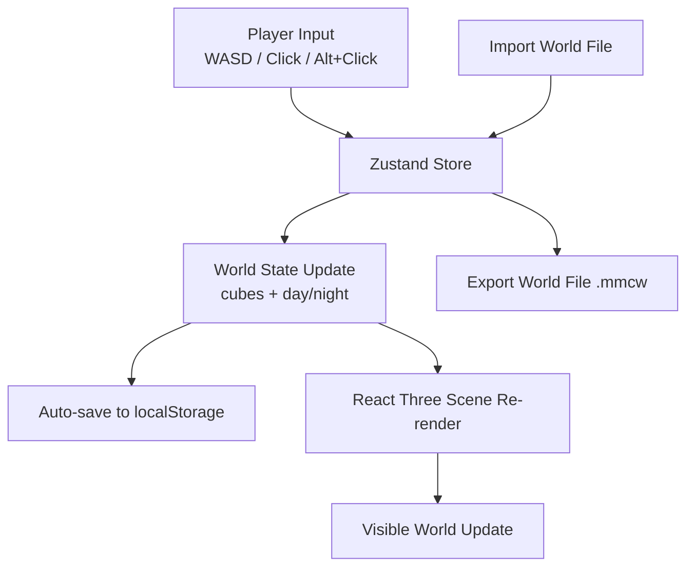

# 🎮 **MiniCraft 3D**

### **Build blocks, export worlds, and play instantly in browser.**

MiniCraft 3D is a lightweight Minecraft-style sandbox made with React + Three.js.
Place blocks, remove blocks, switch day/night, and export or import your world file.

It also auto-saves progress to localStorage so accidental refreshes do not lose progress.

---

## 🚀 Features

* **First-person block building** with pointer lock controls
* **Multiple block types** (`dirt`, `grass`, `glass`, `wood`, `log`)
* **Day/Night toggle** with dynamic lighting and sky
* **World export/import** (`.mmcw` + JSON fallback import)
* **Auto-save** to localStorage on world updates
* **Docker support** for easy containerized deployment

---

## 📁 Project Structure

```text
mini-minecraft/
│
├── Dockerfile
├── .dockerignore
├── package.json
├── vite.config.js
├── index.html
├── public/
│   └── logo.png
│
└── src/
	├── App.jsx
	├── main.jsx
	├── index.css
	│
	├── constants/
	│   └── textureColors.js
	│
	├── hooks/
	│   └── useKeyboard.js
	│
	├── store/
	│   └── useStore.js
	│
	├── utils/
	│   └── worldSerialization.js
	│
	└── components/
		├── ui/
		│   ├── Crosshair.jsx
		│   ├── Menu.jsx
		│   ├── StartOverlay.jsx
		│   └── TextureSelector.jsx
		│
		└── world/
			├── CelestialBodies.jsx
			├── Cube.jsx
			├── Cubes.jsx
			├── FPV.jsx
			├── Ground.jsx
			└── Player.jsx
```

---

## 📥 Installation

### 📦 Clone repository

```bash
git clone https://github.com/ArchitJ6/MiniCraft-3D.git
cd MiniCraft-3D
```

### 🔧 Install dependencies

```bash
npm install
```

---

## 🛠 Run Locally

### Development

```bash
npm run dev
```

Default Vite URL:

```text
http://localhost:5173
```

### Lint

```bash
npm run lint
```

### Production build preview

```bash
npm run build
npm run preview
```

---

## 🐳 Run with Docker

### 1) Build image

```bash
docker build -t minicraft-3d .
```

### 2) Run container

```bash
docker run --rm -p 8080:80 minicraft-3d
```

Open:

```text
http://localhost:8080
```

---

## 🧠 How It Works

MiniCraft 3D uses React Three Fiber for rendering, Cannon for physics, and Zustand for world state.
When world changes happen (add/remove block, day/night, file import), state is auto-persisted locally.



---

## 📤 World Data

* **Auto-save**: world is stored in localStorage
* **Export**: download world as `.mmcw`
* **Import**: load `.mmcw` (and JSON-compatible formats)

---

## 🤝 Contributing

Contributions are welcome:

* Add new block/material types
* Improve UI/UX and menus
* Add terrain generation
* Add multiplayer or inventory systems

---

## 🙌 Credits

* **Creator**: [@ArchitJ6](https://github.com/ArchitJ6)
* **Repository**: [MiniCraft-3D](https://github.com/ArchitJ6/MiniCraft-3D)

---

## 📜 License

MIT License
